# CS563, Intro to Web Development - Final Project, Tayte Waterman

## About

The following is the final project for Portland State University, CS563 Intro To Web Development Fall 2026 course. Within it is a personal website containing about, resume, project, and contact info for Tayte Waterman as a personal website. The website is built via `HTML`, `CSS`, and `JavaScript` and hosted via GitHub.


Details of the website implementation and design history can be found within the docs in this repository.

## Access

The contents of this web-page are hosted by GitHub and can be accessed via: [https://watermanpdx.github.io/CS563-Final-Project/](https://watermanpdx.github.io/CS563-Final-Project/)

Contents may also be tested by locally cloning the contents of this repository and serving `index.html` in the root of the repository file structure. This project is implemented as a single page, switching contents via `JavaScript`. No additional `.html` files are provided or required.

## Features

### Navigation and Page Control

Different "pages" of content can be accessed via the top Navigation Bar. In it are presented 4 major sections: About, Projects, Experience, and Contents. Clicking on these links will navigate the user to the respective section of the webpage. The navbar is fixed at the top of the page so that it is always accessible despite where the user has scrolled on the page.

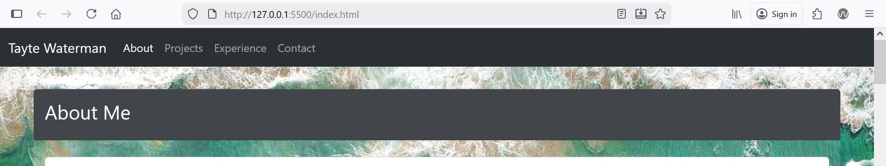

In this implementation only one `index.html` has been provided. All "pages" in this file are defined in a single `HTML` document. `JavaScript` code is used to hide and present the desired content via controlling the Bootstrap `d-block` and `d-none` classes applied to each major section.

The navigation bar is built via the Bootstrap [navbar](https://getbootstrap.com/docs/5.3/components/navbar/) component. This allows for easy setup, styling, and responsiveness. The navigation bar automatically switches between an expanded and compressed with menu variant based on screen width. When items are clicked the menu auto-dismisses based on manually applied `JavaScript`.

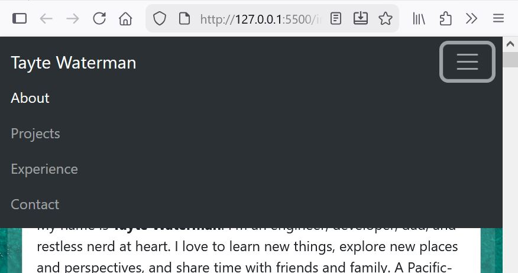

### About

The About section provides a brief summary of me as well as a "gallery" of personal photos of myself, my family, and hobby photography.

All of the content is contained within a central Bootstrap [card](https://getbootstrap.com/docs/5.3/components/card/). This pattern was used for the majority of the website as it was an easy way to cohesively contain contents for major sections. For these major section cards, the background color was manually altered via `CSS` to be transparent. This helped visually cue where content belonged, while still allowing the background image to come through.

The "gallery" section in about contained a set of images programmatically applied (`JavaScript` insertion to the main `HTML` document). The gallery was built on the Bootstrap [grid](https://getbootstrap.com/docs/5.3/layout/grid/) system. This allowed for easy, responsive control of how the images were presented; 3 columns on large-views, 2 on medium, and 1 on narrow.

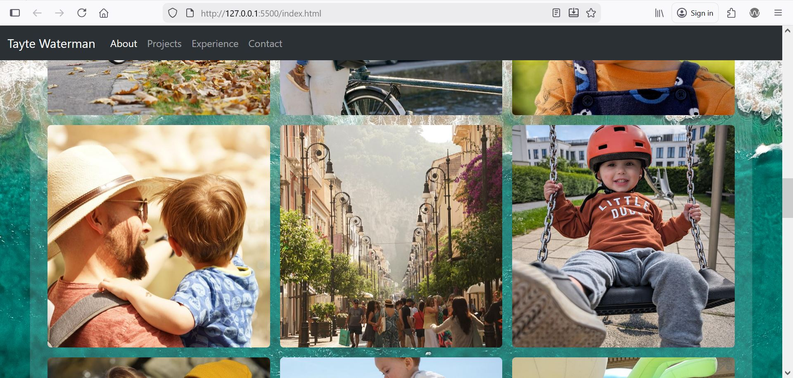

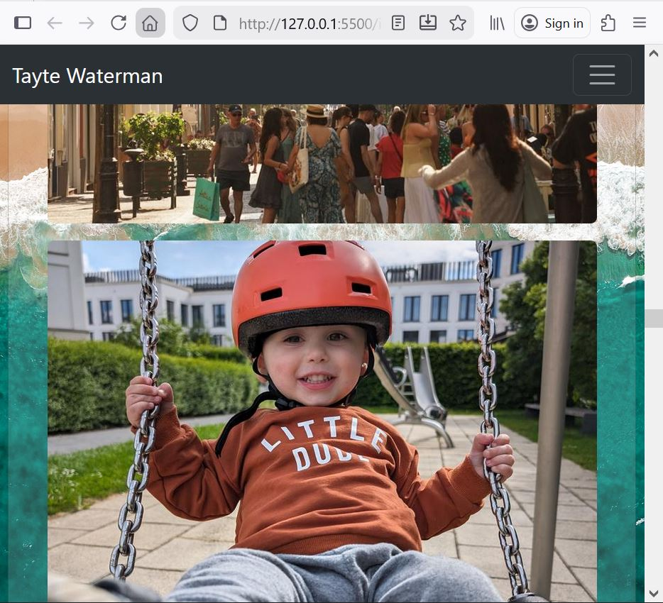

### Projects

The Projects section lists 3 sample projects with images, and links to their source repositories. Like the About section, this section is structured within one major Bootstrap [card](https://getbootstrap.com/docs/5.3/components/card/). However, contained within it, each project has its own card describing the project. The project cards alternate their alignment using Bootstrap [grid](https://getbootstrap.com/docs/5.3/layout/grid/) to break up the sections and make it a bit more visually interesting. They are all responsive such that the relative widths of their images/icons, as well as the alternating layout adjusts with smaller views (alternating is fully removed with small screens).

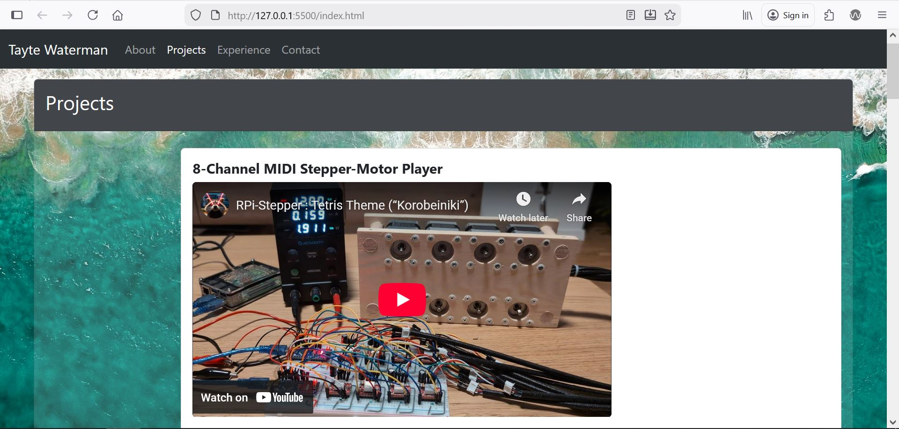

Each project card contains sample images and a description of the content. For the RPi-Stepper project, a sample video is included from Youtube. Each card includes links to the source repository via GitHub icon links embedded in the card footer.

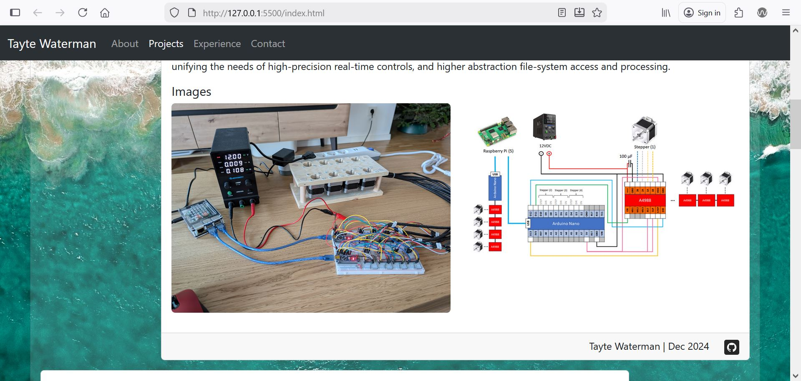

### Experience

The experience section contains general "resume" information. It has information about my education history, accreditations, work history, and general skills. Each of these subsections is contained in its own Bootstrap [accordion](https://getbootstrap.com/docs/5.3/components/accordion/) component. Accordions allow the user to expand and collapse contents via a collapse/expand arrow icon. Since this section contains many elements, this was used to help manage space and (ideally) prevent the user from needing to heavily scroll; just expand and view the sections you care about. By default, all subsections start collapsed.

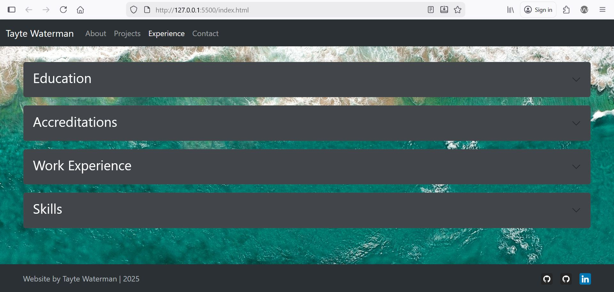

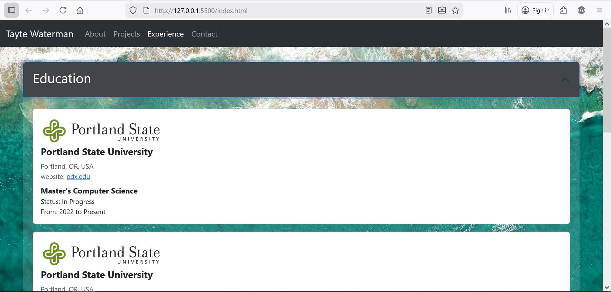

In each of these subsections, much of the content was heavily repeated. In example, the Education section contained repeated entries for universities, the Work Experience section contained repeated entries for different jobs and roles. To enforce consistency for these elements, the population of the contents was done via `JavaScript`, with the contents of the elements defined in an `array` of `json` objects which are inserted into the `document` by iterating over the contents of the `array`.

```Javascript
const educationData = [
  {
    org: "Portland State University",
    logo: { file: "images/logos/psu.png", alt: "psu logo" },
    link: { url: "https://www.pdx.edu/", text: "pdx.edu" },
    location: "Portland, OR, USA",
    major: "Master's Computer Science",
    status: "In Progress",
    duration: { from: "2022", to: "Present" },
  },
  {
    org: "Portland State University",
    logo: { file: "images/logos/psu.png", alt: "psu logo" },
    link: { url: "https://www.pdx.edu/", text: "pdx.edu" },
    location: "Portland, OR, USA",
    major: "Post-Bac Computer Science",
    status: "Completed (Non-Degree)",
    duration: { from: "2020", to: "2022" },
  },
  ...

  const education = document.getElementById("education-contents");
for (let entry of educationData) {
  const div = `
  <div class="card mb-3">
    <div class="card-body">
      <div class="row">
        <div class="col-lg-3 col-sm-6">
          <image
            src="${entry.logo.file}"
            class="img-fluid object-fit-cover"
            alt="${entry.logo.alt}"
            loading="lazy"
          />
        </div>
      </div>
      <h5>
        <strong>${entry.org}</strong>
      </h5>
  ...
    education.insertAdjacentHTML("beforeend", div);
}
```

### Contact

The Contact section allows the user to "contact" me via the provided link in the navbar. In this implementation it does not actually trigger any external email or contact; instead it only captures the submitted info and prints it to the console.

Unlike the other "pages", the contact is instead provided as a pop-up Bootstrap [modal](https://getbootstrap.com/docs/5.3/components/modal/). When the user clicks the Contact link, they are provided with a pop-up form which allows them to write a message and provide a contact email. Contents are linked with an `HTML` `form` and when submitted captured as a `json` object to be printed to the terminal. The `form` settings are used to enforce mandatory fields and proper formatting of inputs; for example email.

In the contact card are also provided basic links to external profiles of mine such as GitHub and LinkedIn.

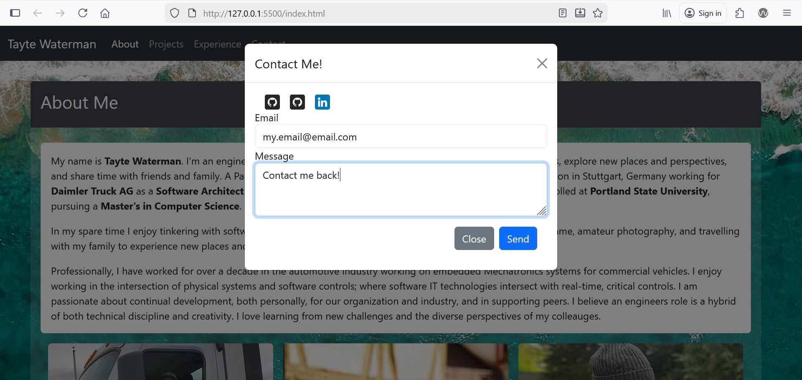

When the user submits a contact request, I also wanted to ensure that the user received confirmation of the successful submission. To do this, I use the Bootstrap [toast](https://getbootstrap.com/docs/5.3/components/toasts/) component to pop-up an auto-dismissing alert informing the user of success.

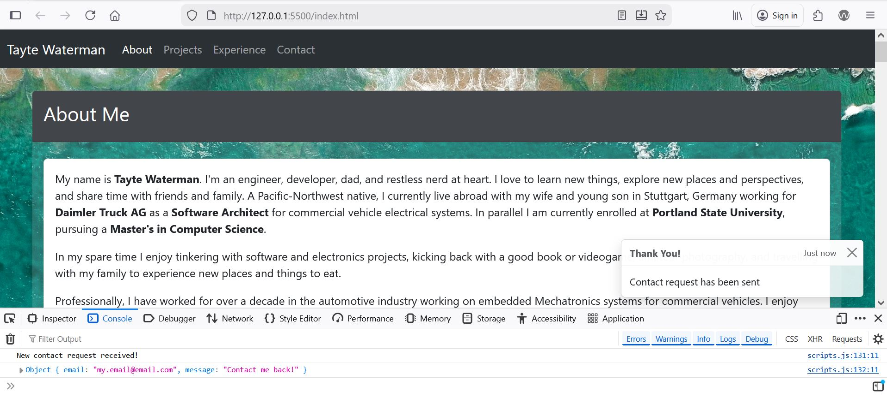

### Footer

A footer with basic disclaimer "Website by Tayte Waterman | 2025" is provided at the bottom including links to common external profiles like GitHub and LinkedIn. As with the navigation bar, I used the Bootstrap [footer templates](https://getbootstrap.com/docs/5.3/examples/footers/) as a basis for my footer code and structuring.

The footer is always applied to the bottom of the page, requiring some adjustment of the `body` element. By default the `footer` applies at the end of the `body` element, which for pages with limited content (example, the collapsed contents of the Experience page) can cause the `footer` to be applied in the middle of the screen. To "force" the `footer` to the bottom, the view-height in `body` had to be set to a minimum view-height of 100% and `main` required the `flex-fill` option to force it to expand to fill the remaining space.

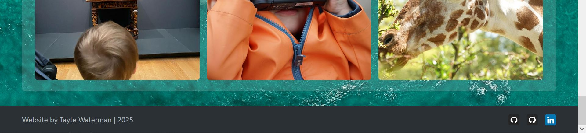

## Journal

History of the development of this website, including major changes and design decisions can be found in the [journal](./journal.md) document in this repository.

## References

### Web Technologies and Frameworks

`HTML` Hyper Text Markup Language - [W3 Schools, HTML Introduction](https://www.w3schools.com/html/html_intro.asp)  
`CSS` Cascading Style Sheet - [W3 Schools, CSS Introduction](https://www.w3schools.com/css/css_intro.asp)  
`JavaScript` - [W3 Schools, JavaScript Introduction](https://www.w3schools.com/js/js_intro.asp)  
`Bootstrap` HTML, CSS, JavaScript Library - [Bootstrap](https://getbootstrap.com/)

### Images and Icons

- Daimler Truck AG, “Daimler Truck AG,” [Online]. Available: [https://www.daimlertruck.com/en](https://www.daimlertruck.com/en). Accessed: Nov. 22, 2025.
- Daimler Truck North America LLC, “Daimler Truck North America,” [Online]. Available: [https://northamerica.daimlertruck.com/](https://northamerica.daimlertruck.com/). Accessed: Nov. 22, 2025.
- Flaticon, “GitHub free icon,” [Online]. Available: [https://www.flaticon.com/free-icon/github_3291695](https://www.flaticon.com/free-icon/github_3291695). Accessed: Nov. 10, 2025.
- Flaticon, “LinkedIn free icon,” [Online]. Available: [https://www.flaticon.com/free-icon/linkedin_3536505?term=linkedin&page=1&position=1&origin=search&related_id=3536505](https://www.flaticon.com/free-icon/linkedin_3536505?term=linkedin&page=1&position=1&origin=search&related_id=3536505). Accessed: Nov. 10, 2025.
- Flaticon, “Search results for ‘German flag’,” [Online]. Available: [https://www.flaticon.com/search?word=german%20flag](https://www.flaticon.com/search?word=german%20flag). Accessed: Nov. 22, 2025.
- Flaticon, “Search results for ‘Spain flag’,” [Online]. Available: [https://www.flaticon.com/search?word=spain%20flag](https://www.flaticon.com/search?word=spain%20flag). Accessed: Nov. 22, 2025.
- Flaticon, “Search results for ‘USA flag’,” [Online]. Available: [https://www.flaticon.com/search?word=usa%20flag](https://www.flaticon.com/search?word=usa%20flag). Accessed: Nov. 22, 2025.
- Flaticon, “Search results for ‘w’,” [Online]. Available: [https://www.flaticon.com/search?word=w](https://www.flaticon.com/search?word=w). Accessed: Nov. 22, 2025.
- Gigaphoton USA Inc., “Gigaphoton USA,” [Online]. Available: [https://www.gigaphoton.com/](https://www.gigaphoton.com/). Accessed: Nov. 22, 2025.
- Oregon Institute of Technology, “Oregon Institute of Technology,” [Online]. Available: [https://www.oit.edu/](https://www.oit.edu/). Accessed: Nov. 22, 2025.
- Oregon State Board of Examiners for Engineering & Land Surveying (OSBEELS), “OSBEELS,” [Online]. Available: [https://www.oregon.gov/osbeels/](https://www.oregon.gov/osbeels/). Accessed: Nov. 22, 2025.
- Portland State University, “Portland State University,” [Online]. Available: [https://www.pdx.edu/](https://www.pdx.edu/). Accessed: Nov. 22, 2025.
- “iPhone‑Wallpaper 8Ogfqvw15Rg,” Unsplash, [Online]. Available: [https://unsplash.com/photos/iphone-wallpaper-8Ogfqvw15Rg](https://unsplash.com/photos/iphone-wallpaper-8Ogfqvw15Rg). Accessed: Nov. 9, 2025.
